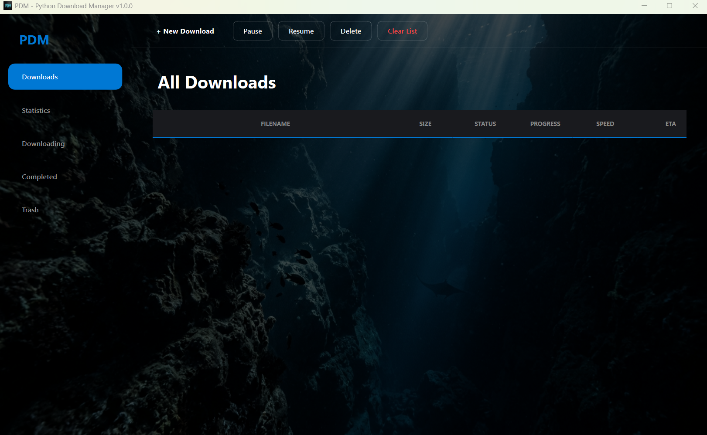
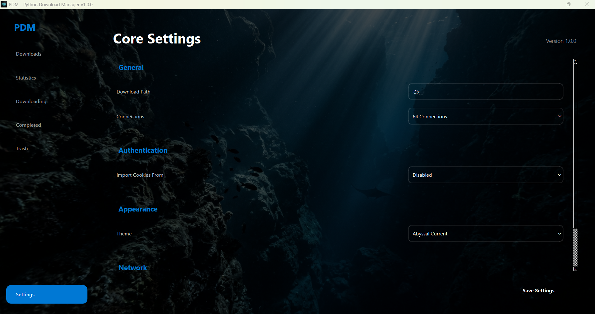

# ⚡ PDM - Python Download Manager

**PDM** is a high-performance, multi-protocol download manager built with Python 3.13 and PySide6. It features a modern glassmorphic interface and a dual-engine transmission system designed for maximum versatility across direct links, HLS streams, and social platforms.

<!-- Placeholder for Main Dashboard Screenshot -->


---

## 🌟 Key Features

### 🚀 High-Speed Transmission
- **Turbo Multi-Threading**: Segmented downloading with up to **64 concurrent connections** for maximum bandwidth utilization.
- **M3U8 / HLS Support**: Native capability to download segmented HLS streams and merge them into high-quality, integrated **MP4** files automatically.
- **Intelligent Probing**: Eliminates "Unknown" sizes by using advanced HTTP range-request probing to force servers to report total content length.
- **Resume Capability**: Persistent task management via SQLite, supporting full pausing and resuming of active downloads.

### 🎥 Universal Media Extraction
- **Social Media Support**: Integrated support for **YouTube, Facebook, Instagram, TikTok, and X** via a resilient extraction layer.
- **Maximum Quality Defaults**: Automatically retrieves the highest available resolution for video and high-bitrate **192kbps MP3** for audio extraction.
- **Dynamic Format Selector**: Choose between full video (Integrated MP4) or audio-only extraction during task initialization.

### 🔐 Advanced Authentication
- **Session Synchronization**: Securely imports cookies from system browsers (Chrome, Firefox, Brave, Edge, etc.) to access restricted OTT streams.
- **Manual Credential Injection**: Supports Username/Password authentication for sites requiring direct login.
- **Raw Cookie Support**: Allows pasting session strings directly from browser developer tools to bypass 401 Unauthorized walls.

### 📁 Advanced Content Crawling
- **Generic HTML Scraper**: An internal PDM module that crawls any website to find hidden `<video>`, `<source>`, and `<iframe>` tags.
- **Directory Scanning**: Bulk-detect video assets from HTTP or FTP index pages and add them selectively to the queue.

### 🎨 Visual Identity
- **Cinematic Experience**: 13 high-resolution atmospheric background profiles selectable via system settings.
- **Glassmorphism UI**: A sleek, frosted-glass interface that maintains high contrast and perfect readability.

<!-- Placeholder for Settings and Themes Screenshot -->


---

## 🛠 Usage Instructions

1.  **Add Task**: Paste any URL in the dashboard and click **Scan Source**.
2.  **Select Format**: Choose between **Video (Maximum Quality)** or **Audio (MP3 Extraction)**.
3.  **Authentication**: If the site requires login, enable the Authentication group to provide credentials or paste cookies.
4.  **Deploy**: Click **Download Now** to add the task to the queue and monitor real-time progress.
5.  **Manage**: Use the toolbar to Pause, Resume, or Delete tasks. History can be cleared via the **Clear List** button.

---

## 💻 Technical Requirements

- **Python**: 3.13 or higher.
- **Core Libraries**: `PySide6`, `requests`, `yt-dlp`, `m3u8`, `beautifulsoup4`, `ffmpeg-python`.
- **System Tools**: `FFmpeg` is required for stream merging and audio conversion.

```bash
# 1. Install dependencies
pip install -r requirements.txt

# 2. Launch Application
python3 main.py
```

---
© 2026 PDM - Python Download Manager. v1.0.0
