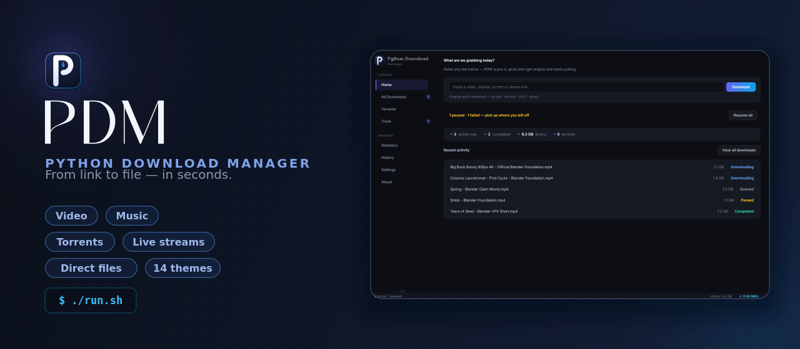
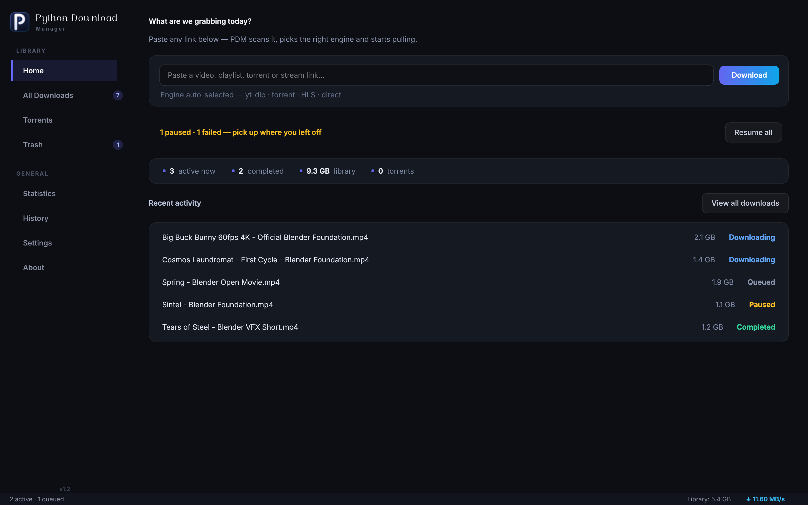
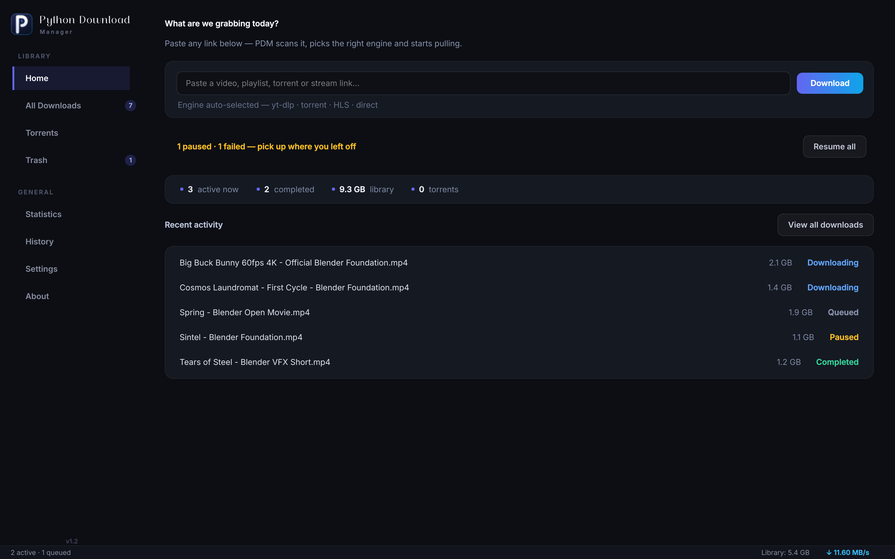
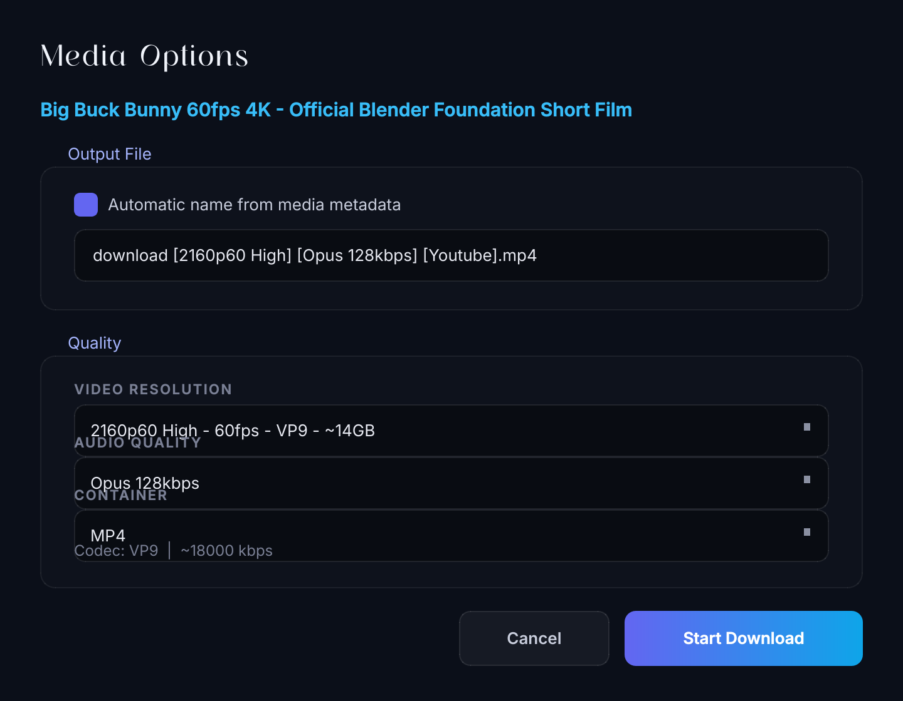
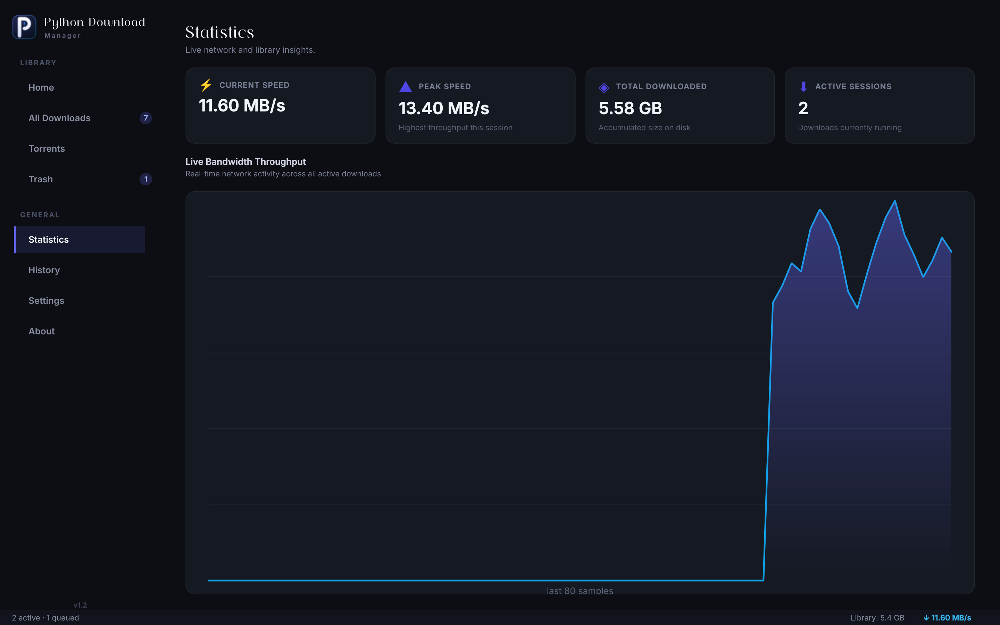

<div align="center">



# PDM — Python Download Manager

**One desktop app for every download.** Videos, playlists, torrents, direct files and live streams —
PDM picks the right engine automatically and gets out of your way.

[](https://www.python.org/)
[](https://doc.qt.io/qtforpython/)
[](#-installation)
[](LICENSE)
[](#-development--testing)

[Features](#-features) · [Installation](#-installation) · [Architecture](#-architecture) · [Contributing](#-contributing) · [Legal](#-legal-notice)

</div>

---

## Why PDM?

Most download tools do one thing. PDM routes **every** link you throw at it through the engine
that handles it best — automatically:

| You paste… | PDM uses |
|---|---|
| YouTube / social video links | **yt-dlp** with format picker, cookies and smart naming |
| `magnet:` or `.torrent` | **libtorrent** engine with live piece progress |
| HLS / DASH stream pages (`.m3u8` / `.mpd`) | **N_m3u8DL-RE** (auto-installed) with native HLS fallback |
| Plain file URLs | Multi-segment accelerator with resume + integrity checks |

No per-site configuration. No browser extensions. One queue, one library.

## ✨ Features

### 🚀 Transfer Engine
- **Multi-segment HTTP(S) accelerator** — parallel byte-range connections, pause/resume, automatic fallback to single-stream, and a byte-integrity gate before anything is marked complete
- **Queue with concurrency limits**, per-download speed caps, retry with backoff
- **Trash-soft delete** — nothing disappears until you empty it

### 🎬 Smart Media Handling
- **yt-dlp integration** with a visual format picker (resolution × fps × codec × size)
- **Smart naming** — resolution, codec and source baked into clean filenames
- **Browser login reuse** — opt-in cookies from Firefox/Chrome/Chromium/Brave/Edge/Safari for members-only content you can access
- **Audio extraction** to MP3 with one toggle

### 📡 OTT / Live Streams
- **SuperScan** page harvester finds `.m3u8` / `.mpd` / `.mp4` payloads hidden in HTML, JSON blobs and app bundles
- **N_m3u8DL-RE** pipeline for segmented streams with referer/UA passthrough — installed automatically by the bootstrap scripts
- **Native HLS downloader** as a dependency-free fallback (no ffmpeg required for TS capture)
- Login-wall and DRM detection with clear messaging — PDM tells you *why* something can't be fetched instead of failing silently

### 🌊 BitTorrent
- Magnet + `.torrent`, sequential or rarest-first, piece-level progress
- Live two-way sync between the Torrents view and your main library
- Metadata-aware renaming once peers resolve the real file name

### ⚙️ Desktop App Polish
- **Landing page** — paste a link straight from the dashboard; live stats, resume-all for paused/failed items and recent activity at a glance
- 14 themes including 12 hand-tuned color schemes, light + dark
- System tray, global shortcuts, clipboard watching, download history
- SQLite storage in **WAL mode** — crash-safe, concurrent-safe

## 📸 Screenshots

<div align="center">
<table>
<tr>
<td align="center" width="50%"><br/><sub><b>Home — paste a link, everything auto-routed</b></sub></td>
<td align="center" width="50%"><br/><sub><b>Library — live progress, speed, ETA</b></sub></td>
</tr>
<tr>
<td align="center" width="50%"><br/><sub><b>Format picker — resolution × fps × codec × size</b></sub></td>
<td align="center" width="50%"><br/><sub><b>Bandwidth statistics</b></sub></td>
</tr>
</table>
<p><sub><i>More: <a href="assets/screenshots/add_url.png">scan dialog</a> · <a href="assets/screenshots/settings.png">settings (14 themes, cookies, speed limits)</a></i></sub></p>
</div>

## 🛠 Installation

### Option 1 — One command (recommended)

```bash
git clone https://github.com/pintukumar-sutradhar/PDM---Python-Download-Manager.git
cd PDM---Python-Download-Manager
./run.sh          # Linux — everything automatic
run.bat           # Windows — double-click or run in cmd
```

The bootstrap script creates the virtualenv, installs all dependencies (including PySide6 and a
static FFmpeg fallback), downloads the **N_m3u8DL-RE** engine for your platform and launches PDM.
Nothing else to configure.

> `bash run.sh --live` also runs the full network self-test before launching.

### Option 2 — Manual

```bash
git clone https://github.com/pintukumar-sutradhar/PDM---Python-Download-Manager.git
cd PDM---Python-Download-Manager
python3 -m venv .venv
source .venv/bin/activate        # Windows: .venv\Scripts\activate
pip install -r requirements.txt
python3 pdm.py
```

**Requirements:** Python 3.10+. Everything else installs itself on first run.

- FFmpeg optional (`static-ffmpeg` bundled as fallback)
- Node.js/deno optional (improves some YouTube extractions)
- BitTorrent uses `libtorrent`, installed automatically when a wheel exists for your Python; on very new Python versions without a wheel, everything else still works and only torrent support is disabled

## 🚀 Usage

1. **Paste anything** — a YouTube link, a magnet, a stream page URL, a direct file
2. PDM scans it and shows exactly what it found (formats, streams, files)
3. Pick where to save; hit download
4. Watch progress in the library, or minimize to tray

<details>
<summary><b>⌨️ Keyboard shortcuts</b></summary>

| Shortcut | Action |
|---|---|
| `Ctrl+N` | New download |
| `Ctrl+R` / `Del` | Resume / move to trash selection |
| `Ctrl+Q` | Quit |

</details>

## 🏗 Architecture

```
pdm.py                  app entry, splash, single-instance guard
├── ui/                 Qt widgets, views, themes, dialogs
│   ├── main_window.py  navigation, library, torrent↔library sync
│   └── widgets/        home dashboard, settings, statistics cards
├── core/
│   ├── download_engine.py   queue, worker lifecycle, signals
│   ├── scanner.py           URL classification (yt-dlp → SuperScan fallback)
│   ├── ott_superscan.py     page harvester for hidden stream manifests
│   ├── nre.py               N_m3u8DL-RE process control + progress parsing
│   ├── database.py          SQLite (WAL) schema + retry-safe writes
│   └── jsruntime.py         JS runtime detection, cookie plumbing
├── download/
│   ├── worker.py            routing: NRE → native HLS → direct → engine
│   ├── native_engine.py     dependency-free HLS downloader
│   ├── torrent_engine.py    libtorrent wrapper
│   └── segment.py           multi-segment byte-range downloader
└── scripts/selftest.py      20-check verification suite (offline + live)
```

## 🧪 Development & Testing

```bash
python3 scripts/selftest.py          # 17 offline checks
python3 scripts/selftest.py --live   # + 3 live network tests (YouTube, HLS, full download)

PDM_VERBOSE=1 python3 pdm.py         # verbose console during development
```

Every module is covered by the self-test: database lifecycle, scanner ordering guarantees,
SuperScan harvesting, NRE command building, worker routing, UI boot, themes and more.

## 🗺 Roadmap

- [ ] Per-site OTT tuning as data-driven rules
- [ ] Scheduler (start/stop windows, off-peak throttling)
- [ ] Browser extension for one-click hand-off
- [ ] Portable Windows build

## 🤝 Contributing

PRs welcome. Keep the self-test green:

```bash
python3 scripts/selftest.py
```

Please read [CONTRIBUTING.md](CONTRIBUTING.md) and the [Code of Conduct](CONTRIBUTING.md) first.

## 🔒 Security

Downloaded content is stored unencrypted in your chosen folder. Cookie reuse is **opt-in**,
per-download, and never leaves your machine. Report vulnerabilities via
[GitHub Issues](https://github.com/pintukumar-sutradhar/PDM---Python-Download-Manager/issues).

## 📄 License

[MIT](LICENSE) — free to use, modify and ship.

## ⚠️ Legal Notice

PDM is a download manager. It does **not** bypass DRM or break content protection, and the
authors do not endorse piracy. You are responsible for complying with the terms of service of
any site you download from and with your local laws. Download only what you have the right to
download.

<div align="center">
<sub>Built with Python, PySide6, yt-dlp, libtorrent and N_m3u8DL-RE.</sub>
</div>
